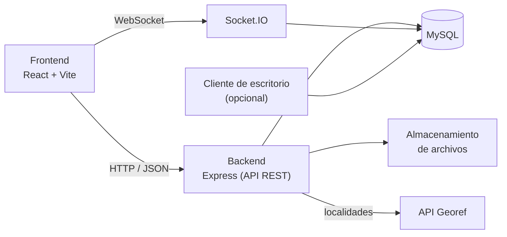

# 🐾 PataHogar

Plataforma web de adopción de mascotas: conecta a personas que ofrecen animales en adopción con quienes buscan adoptar, con búsqueda por cercanía, chat en tiempo real y verificación de organizaciones protectoras.


---

## Tabla de contenidos

- [Características](#características)
- [Tecnologías](#tecnologías)
- [Arquitectura](#arquitectura)
- [Requisitos previos](#requisitos-previos)
- [Instalación](#instalación)
- [Configuración](#configuración)
- [Ejecución](#ejecución)
- [Primeros pasos](#primeros-pasos)
- [Estructura del proyecto](#estructura-del-proyecto)
- [Documentación técnica](#documentación-técnica)
- [Seguridad](#seguridad)
- [Licencia](#licencia)
- [Autor](#autor)

---

## Características

**Cuentas y sesiones**
- Registro e inicio de sesión con contraseñas almacenadas mediante hash (bcrypt).
- Autenticación con JWT de corta duración y *refresh token* rotativo en cookie `httpOnly`, con opción "Recordarme".
- Roles de usuario y administrador; suspensión de cuentas.

**Publicaciones de mascotas**
- Alta, edición y baja de publicaciones con hasta 10 fotos, procesadas en tres tamaños (miniatura, mediana y original).
- Edad cargada por fecha de nacimiento (se recalcula automáticamente) o de forma manual.
- Estados de la publicación: disponible, en proceso, adoptada y desactualizada.
- Datos de salud (vacunación, castración, desparasitación) y datos de contacto opcionales.

**Búsqueda**
- Filtros por especie, sexo, tamaño, rango de edad, salud y texto libre.
- **Búsqueda por cercanía** con cálculo de distancia (fórmula de Haversine) y ordenamiento por proximidad.
- Autocompletado de localidades de toda Argentina mediante la API pública Georef.
- Ubicación verificada opcional mediante geolocalización del navegador.

**Interacción**
- Favoritos.
- **Chat en tiempo real** (WebSocket) con conversaciones por mascota, agrupadas por persona.
- Notificaciones en tiempo real y centro de notificaciones.
- Perfiles públicos con historial de publicaciones.

**Verificación de organizaciones**
- Solicitud de verificación para refugios, veterinarias y asociaciones, con documentación adjunta (múltiples archivos por tipo).
- Insignia de verificado (tilde azul) y búsqueda de perfiles verificados.
- Integración con una aplicación de escritorio de administración mediante la base de datos compartida.

**Administración**
- Panel de moderación: suspensión, reactivación y eliminación de usuarios, y registro de auditoría.
- Moderación de publicaciones de terceros.

---

## Tecnologías

| Capa | Tecnologías |
|---|---|
| **Frontend** | React 19, React Router 7, Vite 8, socket.io-client, CSS propio (sin framework de UI) |
| **Backend** | Node.js (≥ 22.12), Express 5, Socket.IO 4 |
| **Base de datos** | MySQL 8, Knex.js (consultas y migraciones) |
| **Autenticación** | JSON Web Tokens, bcrypt, cookies `httpOnly` |
| **Archivos e imágenes** | Multer, Sharp |
| **Validación y seguridad** | express-validator, Helmet, CORS, express-rate-limit |
| **Servicios externos** | API Georef (Gobierno de Argentina) para localidades |

---

## Arquitectura

El repositorio es un *monorepo* con dos aplicaciones independientes (`backend/` y `frontend/`) que se comunican mediante una API REST y WebSocket. Una aplicación de escritorio externa puede compartir la misma base de datos para gestionar las solicitudes de verificación.



El backend sigue una arquitectura en capas: **rutas → validadores → controladores → repositorios / servicios → base de datos**. El detalle se encuentra en la [documentación técnica](docs/README.md).

---

## Requisitos previos

| Software | Versión mínima |
|---|---|
| [Node.js](https://nodejs.org/) | 22.12 |
| npm | 10 |
| [MySQL](https://dev.mysql.com/downloads/mysql/) | 8.0 |
| [Git](https://git-scm.com/) | 2.x |

---

## Instalación

### 1. Clonar el repositorio

```bash
git clone https://github.com/<usuario>/<repositorio>.git
cd <repositorio>
```

### 2. Crear la base de datos

Conectarse a MySQL como administrador y ejecutar:

```sql
CREATE DATABASE patahogar CHARACTER SET utf8mb4 COLLATE utf8mb4_unicode_ci;

CREATE USER 'patahogar_app'@'localhost' IDENTIFIED BY 'CONTRASEÑA_SEGURA';
CREATE USER 'patahogar_app'@'127.0.0.1' IDENTIFIED BY 'CONTRASEÑA_SEGURA';
GRANT ALL PRIVILEGES ON patahogar.* TO 'patahogar_app'@'localhost';
GRANT ALL PRIVILEGES ON patahogar.* TO 'patahogar_app'@'127.0.0.1';
FLUSH PRIVILEGES;
```

### 3. Backend

```bash
cd backend
npm install
cp .env.example .env      # en Windows (PowerShell): Copy-Item .env.example .env
```

Completar `backend/.env` (ver [Configuración](#configuración)) y ejecutar las migraciones y los datos iniciales:

```bash
npm run migrate
npm run seed
```

> `npm run seed` carga el catálogo de especies y un conjunto inicial de ciudades. Debe ejecutarse **solo una vez**, sobre una base nueva.

### 4. Frontend

```bash
cd ../frontend
npm install
cp .env.example .env      # en Windows (PowerShell): Copy-Item .env.example .env
```

---

## Configuración

### Backend — `backend/.env`

| Variable | Obligatoria | Descripción | Ejemplo |
|---|:---:|---|---|
| `NODE_ENV` | No | Entorno de ejecución (`development` / `production`). | `development` |
| `PORT` | No | Puerto del servidor (por defecto `4000`). | `4000` |
| `CLIENT_URL` | No | Orígenes permitidos por CORS, separados por coma. | `http://localhost:5173` |
| `DB_HOST` | Sí | Host de MySQL. | `127.0.0.1` |
| `DB_PORT` | No | Puerto de MySQL (por defecto `3306`). | `3306` |
| `DB_NAME` | Sí | Nombre de la base de datos. | `patahogar` |
| `DB_USER` | Sí | Usuario de la base de datos. | `patahogar_app` |
| `DB_PASSWORD` | Sí | Contraseña del usuario. | — |
| `JWT_ACCESS_SECRET` | Sí | Secreto de firma del *access token*. | — |
| `JWT_REFRESH_SECRET` | Sí | Secreto del *refresh token*. | — |
| `JWT_ACCESS_EXPIRES_IN` | No | Vigencia del *access token*. | `15m` |
| `JWT_REFRESH_EXPIRES_IN_DAYS_REMEMBER` | No | Días de sesión con "Recordarme". | `30` |
| `JWT_REFRESH_EXPIRES_IN_DAYS_SESSION` | No | Días de sesión sin "Recordarme". | `1` |
| `LOCATION_MISMATCH_BLOCK_KM` | No | Distancia máxima (km) tolerada entre la ciudad elegida y la geolocalización real. | `100` |

Para generar los secretos JWT (ejecutar dos veces, un valor distinto para cada secreto):

```bash
node -e "console.log(require('crypto').randomBytes(48).toString('hex'))"
```

### Frontend — `frontend/.env`

| Variable | Descripción | Ejemplo |
|---|---|---|
| `VITE_API_URL` | URL base de la API REST. | `http://localhost:4000/api` |
| `VITE_SOCKET_URL` | Origen del servidor (WebSocket y archivos estáticos). | `http://localhost:4000` |

> Los archivos `.env` contienen credenciales y **nunca** deben subirse al repositorio (están excluidos mediante `.gitignore`).

---

## Ejecución

### Modo desarrollo (dos procesos)

Terminal 1 — API en `http://localhost:4000`:

```bash
cd backend
npm run dev
```

Terminal 2 — interfaz en `http://localhost:5173`:

```bash
cd frontend
npm run dev
```

Para acceder desde otro dispositivo de la misma red local, iniciar Vite con `npm run dev -- --host 0.0.0.0` y utilizar la IP de la máquina (actualizando `CLIENT_URL`, `VITE_API_URL` y `VITE_SOCKET_URL` en consecuencia).

### Modo integrado (un solo proceso)

El backend puede servir también el frontend compilado. Desde la raíz del repositorio:

```bash
npm run build     # instala dependencias y compila el frontend
npm start         # inicia el backend, que sirve API + interfaz en http://localhost:4000
```

En este modo no se utilizan `VITE_API_URL` ni `VITE_SOCKET_URL`: el frontend usa rutas relativas.

### Scripts disponibles

| Ubicación | Script | Descripción |
|---|---|---|
| raíz | `npm run build` | Instala dependencias y compila el frontend. |
| raíz | `npm start` | Inicia el backend. |
| raíz | `npm run migrate` / `npm run seed` | Atajos para las migraciones y los datos iniciales. |
| `backend/` | `npm run dev` | Backend con recarga automática (nodemon). |
| `backend/` | `npm start` | Backend en modo normal. |
| `backend/` | `npm run migrate` | Aplica las migraciones pendientes. |
| `backend/` | `npm run migrate:rollback` | Revierte el último lote de migraciones. |
| `backend/` | `npm run migrate:status` | Muestra el estado de las migraciones. |
| `backend/` | `npm run seed` | Ejecuta los *seeds* (especies y ciudades). |
| `frontend/` | `npm run dev` | Servidor de desarrollo de Vite. |
| `frontend/` | `npm run build` | Genera `frontend/dist`. |
| `frontend/` | `npm run lint` | Análisis estático con Oxlint. |

---

## Primeros pasos

1. Abrir la aplicación y crear una cuenta desde **Crear cuenta**. La cuenta queda activa de inmediato.
2. Publicar una mascota desde **Publicar mascota**.
3. Para otorgar permisos de administrador a un usuario, actualizar su rol en la base de datos:

   ```sql
   UPDATE users SET role = 'admin' WHERE email = 'usuario@ejemplo.com';
   ```

   El usuario verá el acceso **Administración** en su menú tras volver a iniciar sesión.

---

## Estructura del proyecto

```
.
├── backend/
│   ├── src/
│   │   ├── config/          # Variables de entorno y configuración de Knex
│   │   ├── controllers/     # Lógica de cada endpoint
│   │   ├── db/
│   │   │   ├── migrations/  # Esquema versionado de la base de datos
│   │   │   └── seeds/       # Datos iniciales (especies, ciudades)
│   │   ├── middleware/      # Autenticación, validación, errores, límites, subida de archivos
│   │   ├── models/          # Repositorios (acceso a datos)
│   │   ├── routes/          # Definición de rutas HTTP
│   │   ├── services/        # Lógica reutilizable (chat, imágenes, tokens, ubicación...)
│   │   ├── sockets/         # Servidor WebSocket
│   │   ├── utils/           # Utilidades (errores, geografía, edad, logs)
│   │   ├── validators/      # Reglas de validación de entrada
│   │   ├── app.js           # Configuración de Express
│   │   └── server.js        # Punto de entrada
│   ├── uploads/             # Archivos subidos (excluido de Git)
│   └── knexfile.js
├── frontend/
│   ├── public/              # Recursos estáticos
│   └── src/
│       ├── api/             # Capa de acceso a la API
│       ├── components/      # Componentes reutilizables
│       ├── context/         # Estado global (sesión, socket, notificaciones)
│       ├── hooks/
│       ├── pages/           # Una página por ruta
│       ├── styles/          # Estilos globales y variables de diseño
│       ├── utils/
│       ├── App.jsx          # Definición de rutas
│       └── main.jsx
├── docs/                    # Documentación técnica
├── package.json             # Scripts de orquestación del monorepo
├── LICENSE
└── README.md
```

---

## Documentación técnica

La documentación completa se encuentra en la carpeta [`docs/`](docs/README.md):

| Documento | Contenido |
|---|---|
| [Arquitectura](docs/01-arquitectura.md) | Componentes, capas, comunicación y decisiones de diseño. |
| [Base de datos](docs/02-base-de-datos.md) | Modelo de datos, tablas, relaciones y migraciones. |
| [API REST y eventos](docs/03-api-rest.md) | Endpoints, contratos de entrada/salida y eventos WebSocket. |
| [Backend](docs/04-backend.md) | Módulos, servicios y procesos internos. |
| [Frontend](docs/05-frontend.md) | Estructura, enrutamiento, estado y componentes. |
| [Seguridad](docs/06-seguridad.md) | Mecanismos de protección y limitaciones conocidas. |
| [Integración con el cliente de escritorio](docs/07-integracion-cliente-escritorio.md) | Contrato de datos para la gestión de verificaciones. |
| [Configuración y operación](docs/08-configuracion-y-operacion.md) | Variables, modos de ejecución y mantenimiento. |

---

## Seguridad

- Contraseñas almacenadas con **bcrypt** (12 rondas).
- *Access token* JWT de 15 minutos mantenido únicamente en memoria; *refresh token* aleatorio, almacenado como hash SHA-256 y entregado en cookie `httpOnly`, con rotación en cada renovación.
- Verificación del estado del usuario en base de datos en cada petición autenticada (la suspensión surte efecto inmediato).
- Consultas parametrizadas (Knex) y validación de toda entrada con express-validator.
- Cabeceras de seguridad (Helmet), CORS restringido y limitación de tasa de peticiones.

Más información en [docs/06-seguridad.md](docs/06-seguridad.md).

---

## Licencia

Distribuido bajo la licencia **MIT**. Consultar el archivo [LICENSE](LICENSE) para más información.

---

## Autor

**Sebastián Carbonetti**
