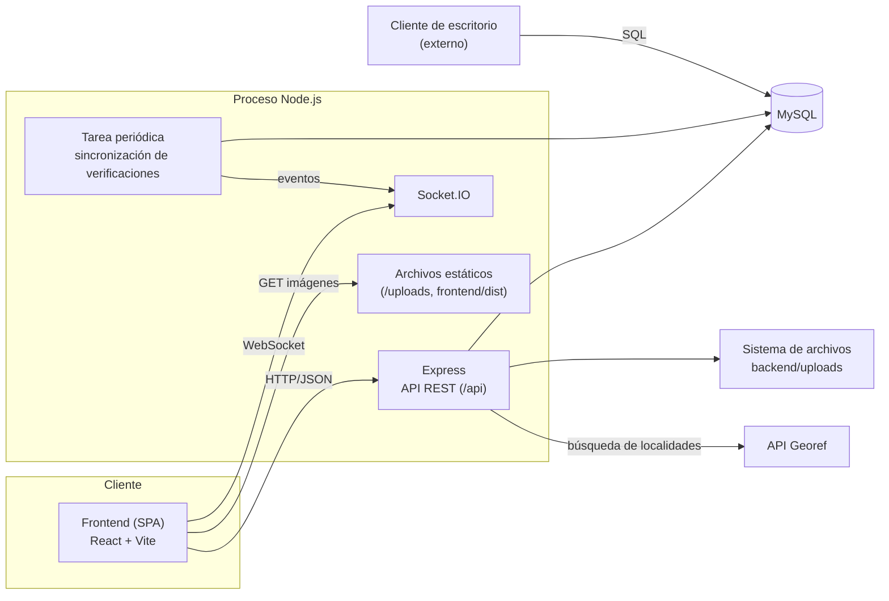
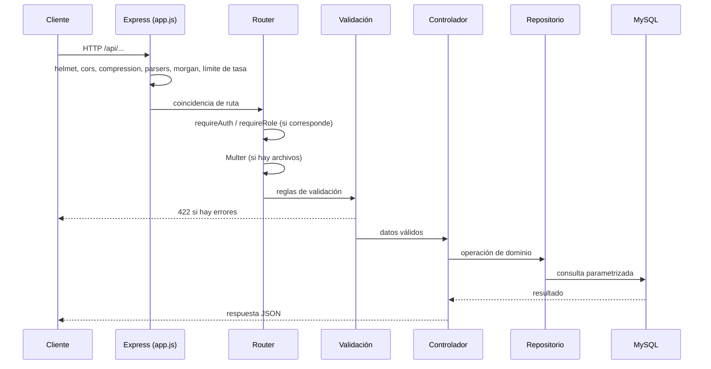

# 1. Arquitectura

## 1.1 Visión general

PataHogar es una aplicación web de tipo SPA (*Single Page Application*) con un backend de API REST y un canal WebSocket para comunicación en tiempo real. El código se organiza como un monorepo con dos aplicaciones desacopladas:

| Aplicación | Directorio | Responsabilidad |
|---|---|---|
| Backend | `backend/` | API REST, WebSocket, acceso a datos, procesamiento de archivos, tareas en segundo plano. |
| Frontend | `frontend/` | Interfaz de usuario (SPA) que consume la API. |

El desacoplamiento permite que otros clientes (aplicaciones móviles o de escritorio) reutilicen la misma API sin modificaciones.

## 1.2 Componentes



| Componente | Tecnología | Función |
|---|---|---|
| API REST | Express 5 | Expone los recursos del dominio bajo el prefijo `/api`. |
| Tiempo real | Socket.IO 4 | Entrega mensajes de chat y notificaciones a los clientes conectados. |
| Persistencia | MySQL 8 + Knex.js | Almacenamiento relacional, consultas y migraciones versionadas. |
| Archivos | Sistema de archivos local | Imágenes procesadas y documentos subidos (`backend/uploads`). |
| Procesamiento de imágenes | Sharp | Generación de variantes de imagen. |
| Localidades | API Georef | Autocompletado de localidades de Argentina. |

## 1.3 Arquitectura en capas del backend

Cada petición HTTP atraviesa las siguientes capas, cada una con una única responsabilidad:

```
Ruta  →  Middleware  →  Validador  →  Controlador  →  Repositorio / Servicio  →  Base de datos
```

| Capa | Directorio | Responsabilidad |
|---|---|---|
| Rutas | `src/routes` | Asocian método y ruta HTTP con una cadena de middlewares y un controlador. |
| Middleware | `src/middleware` | Autenticación, autorización por rol, carga de archivos, validación, manejo de errores, límite de tasa. |
| Validadores | `src/validators` | Reglas declarativas (express-validator) sobre el cuerpo, parámetros y consulta. |
| Controladores | `src/controllers` | Orquestan el caso de uso, aplican reglas de negocio y construyen la respuesta. |
| Repositorios | `src/models` | Único punto de acceso a las tablas; encapsulan las consultas. |
| Servicios | `src/services` | Lógica transversal reutilizable (chat, notificaciones, imágenes, tokens, geolocalización). |
| Utilidades | `src/utils` | Funciones puras y de soporte (errores, distancia, edad, registro). |

Las excepciones se modelan con `ApiError` (código HTTP, mensaje y detalle opcional) y se serializan de forma uniforme en el manejador de errores global.

## 1.4 Ciclo de vida de una petición



## 1.5 Comunicación en tiempo real

- El cliente abre una conexión Socket.IO enviando el *access token* en el *handshake* (`auth.token`).
- El servidor valida el token y asigna el socket a la sala `user:<id>`.
- Los mensajes de chat y las notificaciones se emiten a la sala del destinatario.
- Los envíos de mensajes se realizan por la API REST; el servidor también admite el evento `message:send`. Ambos caminos convergen en `chatService.sendMessage`, que garantiza un comportamiento idéntico (persistencia, notificación y difusión).

## 1.6 Tarea periódica de sincronización

El servicio `verificationSyncService` se inicia junto con el servidor y se ejecuta cada 15 segundos. Procesa las solicitudes de verificación cuyo estado fue modificado externamente (cliente de escritorio) y que aún no fueron notificadas (`user_notified_at IS NULL`). Véase [Integración con el cliente de escritorio](07-integracion-cliente-escritorio.md).

## 1.7 Modos de ejecución

| Modo | Procesos | Descripción |
|---|---|---|
| Desarrollo | Backend (`:4000`) + Vite (`:5173`) | Dos orígenes distintos; CORS habilitado según `CLIENT_URL`. El frontend usa `VITE_API_URL`. |
| Integrado | Backend (`:4000`) | El backend sirve `frontend/dist` y aplica *fallback* a `index.html` para rutas de cliente. Un único origen; el frontend utiliza rutas relativas (`/api`). |

## 1.8 Decisiones de diseño

| Decisión | Justificación |
|---|---|
| Frontend y backend como proyectos independientes | Permite reutilizar la API desde otros clientes. |
| API REST + WebSocket sobre el mismo servidor HTTP | Simplifica la autenticación y el despliegue. |
| Base de datos compartida con el cliente de escritorio | Evita duplicar una API de administración para un único flujo de aprobación. |
| *Access token* en memoria + *refresh token* en cookie `httpOnly` | Reduce la superficie de ataque XSS sobre las credenciales de larga duración. |
| Repositorios como única capa de acceso a datos | Aísla el esquema SQL del resto de la aplicación. |
| Pares de conversación normalizados (`user_a_id < user_b_id`) | Garantiza unicidad por (mascota, par de usuarios) con un índice único. |
| Ubicación de la mascota copiada del propietario al publicar | Evita recalcular y permite indexar las coordenadas de la publicación. |
| Valores de enumeración en español para entidades compartidas con el cliente de escritorio | Mapeo directo con los enumerados del cliente. |
