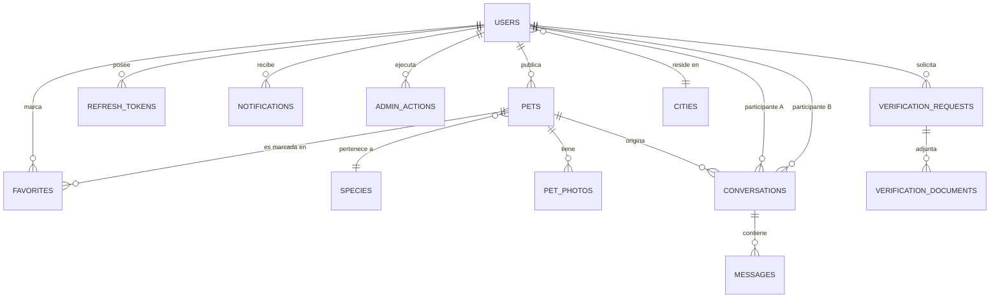

# 2. Base de datos

## 2.1 Generalidades

| Aspecto | Valor |
|---|---|
| Motor | MySQL 8 (InnoDB) |
| Codificación | `utf8mb4` / `utf8mb4_unicode_ci` |
| Acceso | Knex.js (consultas parametrizadas) con el controlador `mysql2` |
| Esquema | Versionado mediante migraciones (`backend/src/db/migrations`) |
| Pool de conexiones | mínimo 2, máximo 10 |

Convenciones:

- Claves primarias `id` autoincrementales (`INT UNSIGNED`).
- Columnas `created_at` y `updated_at` en la mayoría de las tablas.
- Los `TINYINT(1)` se interpretan como booleanos (`typeCast` en la configuración de Knex).
- Las eliminaciones se propagan en cascada para evitar registros huérfanos, salvo donde se indica.

## 2.2 Diagrama entidad-relación

## 2.3 Definición de tablas

### `users`

Cuentas de la plataforma (usuarios, administradores y organizaciones).

| Columna | Tipo | Restricciones | Descripción |
|---|---|---|---|
| `id` | INT UNSIGNED | PK, AI | Identificador. |
| `first_name`, `last_name` | VARCHAR(100) | NOT NULL | Nombre y apellido. |
| `email` | VARCHAR(190) | NOT NULL, UNIQUE | Correo (almacenado en minúsculas). |
| `password_hash` | VARCHAR(255) | NOT NULL | Hash bcrypt. |
| `phone` | VARCHAR(30) | NOT NULL | Teléfono. |
| `profile_photo_url` | VARCHAR(255) | NULL | Ruta relativa de la foto de perfil. |
| `city_id` | INT UNSIGNED | NOT NULL, FK → `cities.id` (RESTRICT) | Localidad declarada. |
| `verified_lat`, `verified_lng` | DECIMAL(10,7) | NULL | Coordenadas obtenidas por geolocalización. |
| `location_source` | ENUM(`geolocation`,`city_only`) | NOT NULL, default `city_only` | Origen de la ubicación efectiva. |
| `role` | ENUM(`user`,`admin`) | NOT NULL, default `user` | Rol. |
| `status` | ENUM(`active`,`banned`) | NOT NULL, default `active` | Estado de la cuenta. |
| `is_verified_organization` | TINYINT(1) | NOT NULL, default 0 | Indica organización verificada (insignia). |
| `last_login_at` | TIMESTAMP | NULL | Último inicio de sesión. |

Índices: `city_id`, `role`, `status`.

### `cities`

Catálogo de localidades. Funciona como caché local de la API Georef.

| Columna | Tipo | Restricciones | Descripción |
|---|---|---|---|
| `id` | INT UNSIGNED | PK, AI | Identificador. |
| `name` | VARCHAR(120) | NOT NULL | Nombre. |
| `province` | VARCHAR(120) | NOT NULL | Provincia. |
| `country` | VARCHAR(80) | NOT NULL, default `Argentina` | País. |
| `latitude`, `longitude` | DECIMAL(10,7) | NOT NULL | Centroide. |
| `georef_id` | VARCHAR(20) | NULL, UNIQUE | Identificador en Georef (nulo para las cargadas por *seed*). |

No existe restricción de unicidad por (nombre, provincia): pueden existir homónimos legítimos.

### `species`

| Columna | Tipo | Restricciones |
|---|---|---|
| `id` | INT UNSIGNED | PK, AI |
| `name` | VARCHAR(60) | NOT NULL, UNIQUE |
| `slug` | VARCHAR(60) | NOT NULL, UNIQUE |

### `pets`

Publicaciones de mascotas.

| Columna | Tipo | Restricciones | Descripción |
|---|---|---|---|
| `id` | INT UNSIGNED | PK, AI | |
| `owner_id` | INT UNSIGNED | NOT NULL, FK → `users.id` (CASCADE) | Propietario. |
| `species_id` | INT UNSIGNED | NOT NULL, FK → `species.id` (RESTRICT) | Especie. |
| `name` | VARCHAR(100) | NOT NULL | Nombre. |
| `breed` | VARCHAR(100) | NULL | Raza. |
| `size` | ENUM(`pequeno`,`mediano`,`grande`) | NOT NULL | Tamaño. |
| `sex` | ENUM(`macho`,`hembra`) | NOT NULL | Sexo. |
| `age_mode` | ENUM(`birth_date`,`manual`) | NOT NULL, default `manual` | Modo de carga de la edad. |
| `birth_date` | DATE | NULL | Solo si `age_mode = birth_date`. |
| `age_years`, `age_months`, `age_days` | INT UNSIGNED | NOT NULL, default 0 | Edad (ver nota). |
| `is_vaccinated`, `is_neutered`, `is_dewormed` | TINYINT(1) | NOT NULL, default 0 | Datos de salud. |
| `description` | TEXT | NOT NULL | Descripción. |
| `status` | ENUM(`disponible`,`en_proceso`,`adoptada`,`desactualizada`) | NOT NULL, default `disponible` | Estado. |
| `status_changed_at` | TIMESTAMP | NOT NULL | Último cambio de estado. |
| `latitude`, `longitude` | DECIMAL(10,7) | NOT NULL | Ubicación de la publicación. |
| `contact_whatsapp` | VARCHAR(30) | NULL | Contacto opcional. |
| `contact_email` | VARCHAR(190) | NULL | Contacto opcional. |

Índices: `species_id`, `status`, `owner_id`, `(latitude, longitude)`.

Notas:

- **Edad:** con `age_mode = manual` se almacenan los valores ingresados sin normalizar. Con `birth_date` se almacena la fecha y los campos de edad son una instantánea; la edad efectiva se recalcula al serializar la entidad.
- **Ubicación:** se copia de la ubicación efectiva del propietario en el momento de la publicación y no se actualiza posteriormente.

### `pet_photos`

| Columna | Tipo | Restricciones |
|---|---|---|
| `id` | INT UNSIGNED | PK, AI |
| `pet_id` | INT UNSIGNED | NOT NULL, FK → `pets.id` (CASCADE) |
| `url_original`, `url_medium`, `url_thumbnail` | VARCHAR(255) | NOT NULL |
| `sort_order` | INT UNSIGNED | NOT NULL, default 0 (0 = portada) |

Regla de negocio: una publicación posee entre 1 y 10 fotos.

### `favorites`

| Columna | Tipo | Restricciones |
|---|---|---|
| `id` | INT UNSIGNED | PK, AI |
| `user_id` | INT UNSIGNED | NOT NULL, FK → `users.id` (CASCADE) |
| `pet_id` | INT UNSIGNED | NOT NULL, FK → `pets.id` (CASCADE) |

Restricción: `UNIQUE (user_id, pet_id)`.

### `conversations`

Conversación entre dos usuarios a propósito de una mascota.

| Columna | Tipo | Restricciones | Descripción |
|---|---|---|---|
| `id` | INT UNSIGNED | PK, AI | |
| `pet_id` | INT UNSIGNED | NOT NULL, FK → `pets.id` (CASCADE) | |
| `user_a_id` | INT UNSIGNED | NOT NULL, FK → `users.id` (CASCADE) | Siempre el identificador **menor** del par. |
| `user_b_id` | INT UNSIGNED | NOT NULL, FK → `users.id` (CASCADE) | Siempre el identificador **mayor** del par. |
| `archived_by_a`, `archived_by_b` | TINYINT(1) | NOT NULL, default 0 | Archivado por cada participante. |
| `deleted_by_a`, `deleted_by_b` | TINYINT(1) | NOT NULL, default 0 | Eliminación lógica por participante. |
| `last_message_at` | TIMESTAMP | NULL | Ordenamiento de listados. |

Restricción: `UNIQUE (pet_id, user_a_id, user_b_id)`. Índices: `user_a_id`, `user_b_id`.

### `messages`

| Columna | Tipo | Restricciones | Descripción |
|---|---|---|---|
| `id` | INT UNSIGNED | PK, AI | |
| `conversation_id` | INT UNSIGNED | NOT NULL, FK → `conversations.id` (CASCADE) | |
| `sender_id` | INT UNSIGNED | NULL, FK → `users.id` (SET NULL) | |
| `content` | TEXT | NOT NULL | Máx. 2000 caracteres (validado en aplicación). |
| `read_at` | TIMESTAMP | NULL | Nulo hasta que el destinatario lo lee. |

Índice: `(conversation_id, created_at)`.

### `notifications`

| Columna | Tipo | Restricciones | Descripción |
|---|---|---|---|
| `id` | INT UNSIGNED | PK, AI | |
| `user_id` | INT UNSIGNED | NOT NULL, FK → `users.id` (CASCADE) | Destinatario. |
| `type` | ENUM | NOT NULL | Ver tabla siguiente. |
| `payload` | JSON | NOT NULL | Datos dependientes del tipo. |
| `is_read` | TINYINT(1) | NOT NULL, default 0 | |

Índice: `(user_id, is_read)`.

| `type` | `payload` (claves) |
|---|---|
| `new_message_on_your_pet` | `conversationId`, `petId`, `petName`, `senderId` |
| `reply_to_inquiry` | `conversationId`, `petId`, `petName`, `senderId` |
| `pet_favorited_adopted` | `petId`, `petName` |
| `post_deleted_by_admin` | `petId`?, `petName`, `reason`? (`marked_outdated`) |
| `verification_approved` | `organizationName` |
| `verification_rejected` | `organizationName`, `reason` |

El texto mostrado al usuario no se persiste: se construye en el cliente a partir de `type` y `payload`.

### `refresh_tokens`

| Columna | Tipo | Restricciones |
|---|---|---|
| `id` | INT UNSIGNED | PK, AI |
| `user_id` | INT UNSIGNED | NOT NULL, FK → `users.id` (CASCADE) |
| `token_hash` | VARCHAR(255) | NOT NULL (SHA-256 del token) |
| `expires_at` | TIMESTAMP | NOT NULL |
| `revoked_at` | TIMESTAMP | NULL |
| `user_agent` | VARCHAR(255) | NULL |
| `ip_address` | VARCHAR(45) | NULL |

Índices: `user_id`, `expires_at`. El token en claro nunca se persiste.

### `admin_actions`

Registro de auditoría de acciones de moderación.

| Columna | Tipo | Restricciones |
|---|---|---|
| `id` | INT UNSIGNED | PK, AI |
| `admin_id` | INT UNSIGNED | NOT NULL, FK → `users.id` (CASCADE) |
| `action_type` | ENUM(`delete_pet`,`ban_user`,`delete_user`,`flag_outdated_pet`) | NOT NULL |
| `target_type` | ENUM(`pet`,`user`) | NOT NULL |
| `target_id` | INT UNSIGNED | NOT NULL (sin FK: el destino puede haber sido eliminado) |
| `reason` | VARCHAR(500) | NULL |

Índices: `admin_id`, `(target_type, target_id)`.

### `verification_requests`

Solicitudes de verificación de organizaciones.

| Columna | Tipo | Restricciones | Descripción |
|---|---|---|---|
| `id` | INT UNSIGNED | PK, AI | |
| `user_id` | INT UNSIGNED | NOT NULL, FK → `users.id` (CASCADE) | Solicitante. |
| `organization_name` | VARCHAR(150) | NOT NULL | |
| `organization_type` | ENUM(`refugio`,`veterinaria`,`asociacion`) | NOT NULL | |
| `responsible_name` | VARCHAR(150) | NOT NULL | |
| `email` | VARCHAR(190) | NOT NULL | |
| `phone` | VARCHAR(30) | NOT NULL | |
| `address` | VARCHAR(255) | NOT NULL | |
| `city`, `province` | VARCHAR(120) | NOT NULL | |
| `years_in_operation` | INT UNSIGNED | NOT NULL | |
| `animals_housed` | INT UNSIGNED | NOT NULL | |
| `website` | VARCHAR(255) | NULL | |
| `description` | TEXT | NOT NULL | |
| `status` | ENUM(`pendiente`,`aprobada`,`rechazada`) | NOT NULL, default `pendiente` | |
| `rejection_reason` | TEXT | NULL | |
| `resolved_at` | TIMESTAMP | NULL | |
| `resolved_by` | INT UNSIGNED | NULL, FK → `users.id` (SET NULL) | |
| `user_notified_at` | TIMESTAMP | NULL | Marca de procesamiento por el backend. |

Índices: `user_id`, `status`.

### `verification_documents`

| Columna | Tipo | Restricciones | Descripción |
|---|---|---|---|
| `id` | INT UNSIGNED | PK, AI | |
| `request_id` | INT UNSIGNED | NOT NULL, FK → `verification_requests.id` (CASCADE) | |
| `document_type` | ENUM(`estatuto`,`dni_responsable`,`habilitacion_municipal`,`fotos_instalaciones`) | NOT NULL | |
| `original_filename` | VARCHAR(255) | NOT NULL | |
| `file_path` | VARCHAR(500) | NOT NULL | Ruta absoluta en el sistema de archivos del servidor. |

Una solicitud puede contener múltiples filas del mismo `document_type`.

### Tablas internas de Knex

`knex_migrations` y `knex_migrations_lock` registran las migraciones aplicadas y gestionan el bloqueo de ejecución concurrente.

## 2.4 Integridad referencial

| Evento | Efecto |
|---|---|
| Eliminación de un `user` | Cascada sobre `pets`, `favorites`, `conversations`, `refresh_tokens`, `notifications`, `admin_actions`, `verification_requests`; `messages.sender_id` y `verification_requests.resolved_by` pasan a `NULL`. |
| Eliminación de un `pet` | Cascada sobre `pet_photos`, `favorites` y `conversations` (y sus `messages`). |
| Eliminación de una `verification_request` | Cascada sobre `verification_documents`. |
| Eliminación de `cities` / `species` referenciadas | Bloqueada (`RESTRICT`). |

Los archivos del sistema de archivos **no** se eliminan por cascada de base de datos; su limpieza se realiza desde la aplicación (ver [Backend](04-backend.md#47-almacenamiento-de-archivos)).

## 2.5 Migraciones

Ubicación: `backend/src/db/migrations`. Se aplican en orden cronológico (`npm run migrate`).

| Migración | Descripción |
|---|---|
| `20260728054856_create_cities_table` | Crea `cities`. |
| `20260728054956_create_users_table` | Crea `users`. |
| `20260728055056_create_refresh_tokens_table` | Crea `refresh_tokens`. |
| `20260728055256_create_species_table` | Crea `species`. |
| `20260728055356_create_pets_table` | Crea `pets`. |
| `20260728055456_create_pet_photos_table` | Crea `pet_photos`. |
| `20260728055556_create_favorites_table` | Crea `favorites`. |
| `20260728055656_create_conversations_table` | Crea `conversations`. |
| `20260728055756_create_messages_table` | Crea `messages`. |
| `20260728055856_create_notifications_table` | Crea `notifications`. |
| `20260728055956_create_admin_actions_table` | Crea `admin_actions`. |
| `20260827143650_add_georef_id_to_cities` | Agrega `georef_id` y elimina la unicidad por nombre y provincia. |
| `20260827145445_add_age_fields_to_pets` | Agrega `age_mode`, `birth_date` y `age_days`. |
| `20260916190000_remove_email_verification_system` | Elimina estructuras de un mecanismo de verificación descartado (tabla `verification_codes` y columnas asociadas de `users`) en bases que las contuvieran. |
| `20260916200000_create_verification_requests` | Crea `verification_requests` y `verification_documents`. |
| `20260916210000_add_verification_badge_system` | Agrega `users.is_verified_organization`, `verification_requests.user_notified_at` y los tipos de notificación `verification_approved` y `verification_rejected`. |

## 2.6 Datos iniciales (*seeds*)

| Archivo | Contenido |
|---|---|
| `01_species.js` | Perro, Gato, Conejo, Ave, Roedor, Pez, Reptil, Otro. |
| `02_cities.js` | Conjunto inicial de las principales localidades de Argentina. |

Ambos *seeds* vacían la tabla destino antes de insertar. Deben ejecutarse únicamente sobre bases nuevas.
