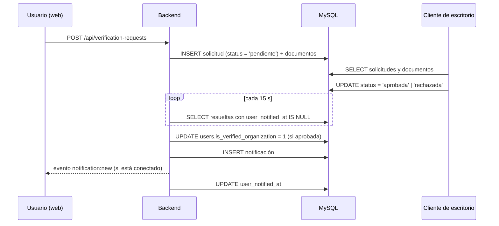

# 7. Integración con el cliente de escritorio

## 7.1 Propósito

La plataforma permite que un cliente externo de administración (aplicación de escritorio) gestione las **solicitudes de verificación** de organizaciones. La integración se realiza a través de la **base de datos compartida**: el cliente de escritorio lee y actualiza las tablas `verification_requests` y `verification_documents`, y el backend de PataHogar reacciona a los cambios mediante una tarea periódica. No existe comunicación directa entre ambas aplicaciones.



## 7.2 Requisitos de operación

1. Instancia de MySQL accesible por ambas aplicaciones, con la base `patahogar`.
2. Backend de PataHogar en ejecución (es quien ejecuta la tarea de sincronización). Si estuviera detenido, las resoluciones se aplican al reiniciarlo.
3. El cliente de escritorio y el backend deben acceder al **mismo sistema de archivos** del servidor para que las rutas de `verification_documents.file_path` resulten válidas.

## 7.3 Contrato de datos

### Tabla `verification_requests`

| Columna | Tipo | Lectura/Escritura por el cliente |
|---|---|---|
| `id` | INT | Lectura |
| `user_id` | INT | Lectura |
| `organization_name` | VARCHAR(150) | Lectura |
| `organization_type` | ENUM(`refugio`,`veterinaria`,`asociacion`) | Lectura |
| `responsible_name`, `email`, `phone` | VARCHAR | Lectura |
| `address`, `city`, `province` | VARCHAR | Lectura |
| `years_in_operation`, `animals_housed` | INT | Lectura |
| `website` | VARCHAR(255) NULL | Lectura |
| `description` | TEXT | Lectura |
| `status` | ENUM(`pendiente`,`aprobada`,`rechazada`) | **Escritura** (transición desde `pendiente`) |
| `rejection_reason` | TEXT NULL | **Escritura** (al rechazar) |
| `resolved_at` | TIMESTAMP NULL | **Escritura** (`NOW()`) |
| `resolved_by` | INT NULL | **Escritura** (opcional; identificador de usuario administrador) |
| `user_notified_at` | TIMESTAMP NULL | **No modificar** (gestionado por el backend) |
| `created_at` | TIMESTAMP | Lectura (fecha de solicitud) |

### Tabla `verification_documents`

| Columna | Tipo | Descripción |
|---|---|---|
| `id` | INT | Identificador. |
| `request_id` | INT | Solicitud a la que pertenece. |
| `document_type` | ENUM(`estatuto`,`dni_responsable`,`habilitacion_municipal`,`fotos_instalaciones`) | Categoría del documento. |
| `original_filename` | VARCHAR(255) | Nombre original del archivo. |
| `file_path` | VARCHAR(500) | Ruta absoluta del archivo en el sistema de archivos del servidor. |

Una solicitud puede tener varios documentos de la misma categoría.

### Correspondencia con enumerados del cliente

| Enumerado del cliente | Valor persistido |
|---|---|
| `TipoOrganizacion.Refugio` | `refugio` |
| `TipoOrganizacion.Veterinaria` | `veterinaria` |
| `TipoOrganizacion.Asociacion` | `asociacion` |
| `EstadoSolicitud.Pendiente` | `pendiente` |
| `EstadoSolicitud.Aprobada` | `aprobada` |
| `EstadoSolicitud.Rechazada` | `rechazada` |

## 7.4 Operaciones

**Listar solicitudes pendientes**

```sql
SELECT id, organization_name, organization_type, responsible_name, email, phone,
       address, city, province, years_in_operation, animals_housed, website,
       description, status, created_at
FROM verification_requests
WHERE status = 'pendiente'
ORDER BY created_at DESC;
```

**Obtener los documentos de una solicitud**

```sql
SELECT id, document_type, original_filename, file_path
FROM verification_documents
WHERE request_id = ?
ORDER BY document_type, id;
```

**Aprobar**

```sql
UPDATE verification_requests
SET status = 'aprobada', resolved_at = NOW(), resolved_by = ?
WHERE id = ? AND status = 'pendiente';
```

**Rechazar**

```sql
UPDATE verification_requests
SET status = 'rechazada', rejection_reason = ?, resolved_at = NOW(), resolved_by = ?
WHERE id = ? AND status = 'pendiente';
```

`resolved_by` puede omitirse (`NULL`).

## 7.5 Efectos en la plataforma web

Tras detectar una solicitud resuelta sin `user_notified_at`, el backend:

| Estado | Efecto |
|---|---|
| `aprobada` | Establece `users.is_verified_organization = 1` para `user_id` y crea la notificación `verification_approved`. La insignia de verificación se muestra en perfil público, detalle de publicaciones, resultados de búsqueda de personas y conversaciones. |
| `rechazada` | Crea la notificación `verification_rejected` con `rejection_reason`. |

En ambos casos registra `user_notified_at`, de modo que cada resolución se procesa una sola vez. La latencia máxima de reflejo es de aproximadamente 15 segundos.

## 7.6 Reglas de negocio relacionadas

- Un usuario no puede tener más de una solicitud en estado `pendiente`.
- Una solicitud siempre incluye al menos un documento de cada una de las cuatro categorías.
- Una vez resuelta, el usuario puede presentar una nueva solicitud.
- Revocar la insignia de verificación de un usuario no está contemplado en este flujo (requiere actualizar `users.is_verified_organization` de forma explícita).
